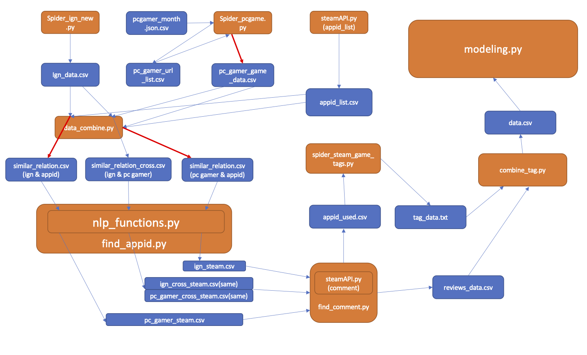

# Steam-game-reviews-DSCI510
Write Python crawlers to get thousands of  game scores from sites and use steam RESTful APIs to get user ratings. Use tools of natural language processing to match similar game names to avoid impact of game nickname. Build Machine Learning model to predict user rating of the game, and The accuracy achieved 0.86

# Major “gotchas”:

### The following gotchas are all about getting the data remotely

### ProxyError:
There may be `ProxyError` during crawling IGN and PCgamer, and getting json from steamAPI.
The program include a restart system. During `ProxyError`, it is able to restart the spiders to retry from cheakpoint instead of run the code again. However, it cannot handle exception like `ConnectionError`, which means the computer is completely disconnected with Internet.

**Please ensure the computer network in good connection.**

### Multi core operation：

To find similar name in steam appid api is not that easy. It need to compare every name in `appid_list.csv` which have 100,000 lines of data. For 2000 games in IGN and 2000 games in PC gamer. It needs 20,000,000 calculation. It cost about 20 hours in a single core in Intel i9-9900k with 4.7GHz overclock. In order to reduce running time. 
I import multiprocessing pack. You can input the number of threads you want to use when you try the python program.

**Please input a appropriate number of threads you want to enable for this project.**

**Warning:** For a single thread, this program may need more than 20 hours to process 

# Packages：

A `environment.yml` file is created at directory

to install `imblrean`, open a terminal at python envs and input `conda install -c glemaitre imbalanced-learn` at python envs

to install `xgboost`, open a terminal at python envs and input `anaconda search -t conda xgboost` to search xgboost and input `conda install -c  anaconda py-xgboost` to install

`nltk` if first import nltk, please input `nltk.download()` at python console

`selenium` use firefox web browser to get IGN which is a dynamic web page. You should download geckodiver for your operating systems such as MacOS or Win10.
The following have a basic tutor for selenium.
https://stackoverflow.com/questions/42204897/how-to-set-up-a-selenium-python-environment-for-firefox 

If fail to run the following cells, please run `conda install ipykernel` at the terminal
and input `python -m ipykernel install --user --name final_project_510 --display-name "env510"`

(final_pro_510 should be the name of the virtual environment and press Kernel above the page and change the kernel.)

# The following is a picture show the structure of the files in this project：
orange blocks are scripts

blue blocks are data files

# What did I set out to study?

Because cloudflare has just upgraded anti-crawler mechanism at October. It is hard to get data from SteamDB (a website with game history data. I have to use reviews in steam to label the games in steam. 

#	What did I Discover?
This project generate a model to predict the popularity of a game by using early data during game released. This model is able to classify the review of a game into 3 class: Good, Fair or Bad with a 80% accuracy. 
An accuracy of 80% for a 3-classification problems is not a low score. A model like this assist developers to decide if the game should increase investment, for example, advertisement or new DLCs to improve game quality.

You can try `python TUO_SUN_proj2.py --source=local` to get the accuracy

or try `python Tuo_SUN_proj2.py --source=remote` to try the whole project. However, this need many hours to process

The goal of the project is to get reviews data from IGN and PCgamer, get game-tag data from steam store, and use these data to predict the popularity of the game. We will use the dataframe below to predict the review score from steam

# What difficulties did I have in completing the project?  

### Dynamic web page
IGN is a game information website with a dynamic web page. I have to simulate page turning by using `selenium` to crawl to html for 2000 games in IGN

### Bad name matching
For a same game, its name in IGN may be different from its name in PCgamer. Even if they are the same, they two may be different from that in steam appid list. For example, 'Sid Meier's Civilization VI' is a game named in steam, but in PCgamer it is named 'Civilization 6'. I have to write an agent to recognize similar names in these three game name lists and minimize Type I and Type II errors.

### Algorithm need a lot of computation:
After designing the recognization agents, it takes me a long time to get create `similar_relation.csv`, `similar_relation_pc.csv`. I try to use multiprocessing to handle this problems.

# What skills did I wish I had while I were doing the project?
The better ability to design and complete a little bit large project. Actually, this project have more than 3000 lines of code (including comments). It is the biggest python project that I have ever tried.

# What would I do “next” to expand or augment the project?    

### Better agent:
To be honest, the agents I set to recognize similar names is far from high efficiency. It compares names one by one. There must be better agent for these problems, for example, clustering, or generate a recognization model from a bigger dataset.

### More website:
There are more game information websites. Review scores from them may increase the accuracy of the model.

### More varied features:
This model uses review scores and game tags of a game, but I think more kind of features should be involved, for example, the price of the game or the publisher of the game
